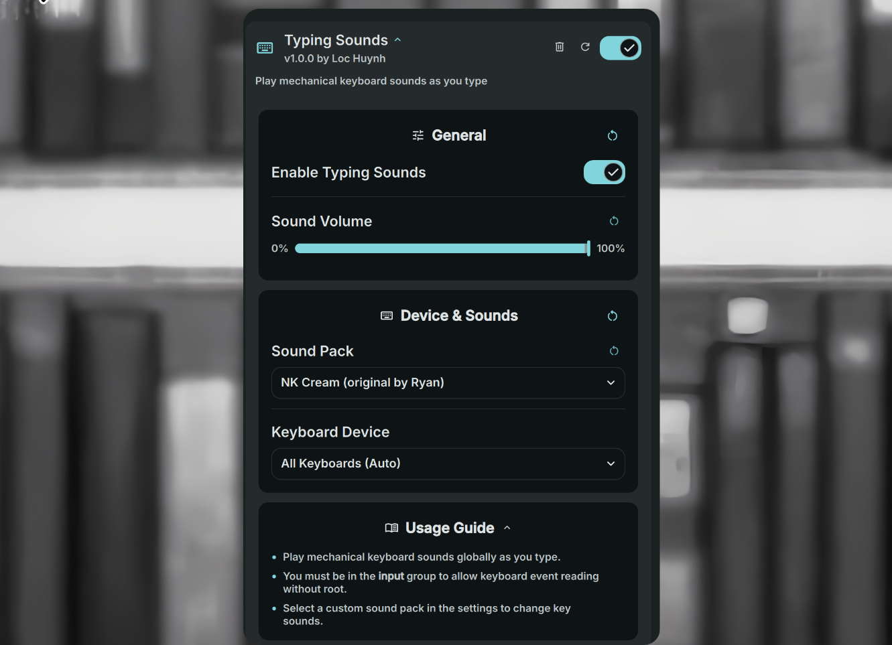

# Typing Sounds

Play mechanical keyboard sounds globally as you type on your system.



## Requirements

- `evtest` - For monitoring specific keyboard events.
- `libinput` **CLI** - For **"All Keyboards"** mode.
- `ffmpeg` - For slicing and transcoding Mechvibes sound packs.
- **Input group** - User must be in the `input` group: `sudo usermod -aG input $USER`.

> [!NOTE]
> On many distros, the libinput CLI is in a separate package: `libinput-tools` (Arch/Debian/Ubuntu) or `libinput-utils` (Fedora). Logout and back in after adding your user to the input group.

## Installation

### Via DMS CLI
```bash
dms plugins install typingSounds
```

### Manual Installation
```bash
git clone https://github.com/hthienloc/dms-typing-sounds ~/.config/DankMaterialShell/plugins/typingSounds
```

## Features
- **Global Keystroke Audio** - Play mechanical keyboard clicks as you type.
- **Low Latency** - Qt6 SoundEffect playback with sub-millisecond latency.
- **Sound Pack Selection** - Supports Mechvibes sound packs.

## Usage

### IPC Commands
You can control the daemon from the command line using DMS IPC:
```bash
# Toggle typing sounds on/off
dms ipc typingSounds toggle

# Enable typing sounds
dms ipc typingSounds enable

# Disable typing sounds
dms ipc typingSounds disable
```

## Roadmap / TODO

- [ ] Add support for custom sound pack directory configuration.
- [ ] Implement volume/pitch randomization per keystroke for organic feedback.
- [ ] Add custom key-to-sound mapping overrides.
- [ ] Bundle more open-source sound packs.

## Credits

- Sound packs are bundled from [Mechvibes](https://github.com/hainguyents13/mechvibes).

## License
MIT
